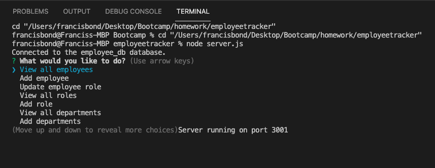

# employeetracker

Title: Employee Tracker

Developer: Francis Bond

Deployment Date: Feb 18, 2022

For: UT Coding Bootcamp

Published: GitHub 

Built with: Javascript, npm inquirer and mysql

## Summary

https://drive.google.com/file/d/1uRlJAs430RBuXCD8NkBlkIqLrR6DISpO/view

Employees tracker is a content management system that is a command line application. This application allows a business owner to view and manage departments, roles and employees.

## Development

Development of this application was relatively straight forward. The biggest challenge came when making queries to the database involving joins. 